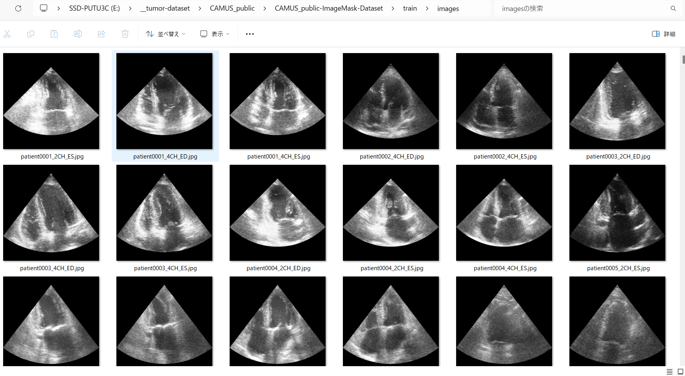
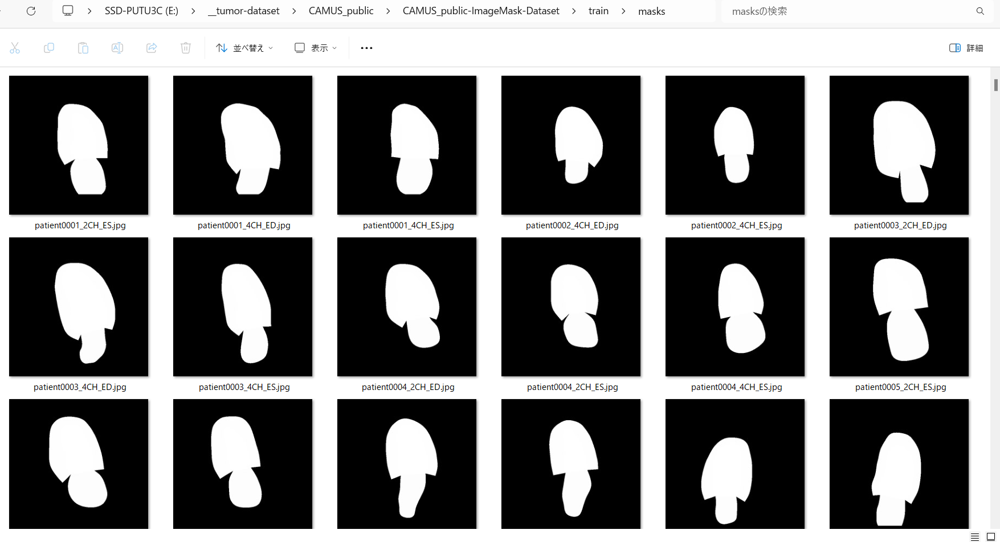
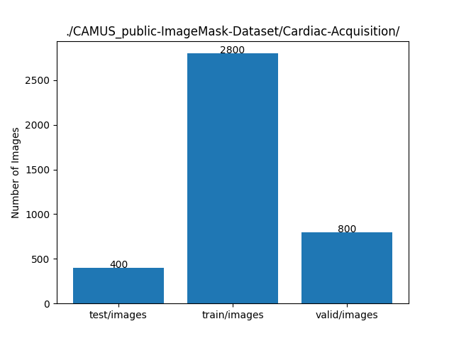

<h2>CAMUS_public-ImageMask-Dataset (2024/02/05)</h2>
This is a CAMUS_public (Cardiac Acquisitions for Multi-structure Ultrasound Segmentation) dataset 
for Image Segmentation.   

<h3>1. Dataset Citatioin</h3>
<a href="https://www.creatis.insa-lyon.fr/Challenge/camus/databases.html">
CAMUS 
Cardiac Acquisitions for Multi-structure Ultrasound Segmentation 
</a>
 
<b>
Dataset properties
</b> 
<pre>
The overall CAMUS dataset consists of clinical exams from 500 patients, acquired at the University 
Hospital of St Etienne (France) and included in this study within the regulation set by the local 
ethical committee of the hospital after full anonymization. 
The acquisitions were optimized to perform left ventricle ejection fraction measurements. 
In order to enforce clinical realism, neither prerequisite nor data selection have been performed. Consequently,

・some cases were difficult to trace;</li>
・the dataset involves a wide variability of acquisition settings;
・for some patients, parts of the wall were not visible in the images;
・for some cases, the probe orientation recommendation to acquire a rigorous four-chambers
view was simply impossible to follow and a five-chambers view was acquired instead.
This produced a highly heterogeneous dataset, both in terms of image quality and pathological cases, 
which is typical of daily clinical practice data.

The dataset has been made available to the community HERE.
The dataset comprises : 
i) a training set of 450 patients along with the corresponding manual references based on 
the analysis of one clinical expert; 
ii) a testing set composed of 50 new patients. 
The raw input images are provided through the raw/mhd file format.
</pre>
 
This work has published to IEEE TMI journal. <b>You must cite this paper for any use of the CAMUS database</b>. 

S. Leclerc, E. Smistad, J. Pedrosa, A. Ostvik, et al. 
"Deep Learning for Segmentation using an Open Large-Scale Dataset in 2D Echocardiography" in  
IEEE Transactions on Medical Imaging, vol. 38, no. 9, pp. 2198-2210, Sept. 2019. 
 
doi: 10.1109/TMI.2019.2900516 
 

<h3>
2. Download master dataset
</h3>
  Please download the original image and mask dataset <b>CAMUS_public</b> from the following website. 

<a href="https://humanheart-project.creatis.insa-lyon.fr/database/#collection/6373703d73e9f0047faa1bc8">CAMUS_public</a>
 

The dataset <b>CAMUS_public</b> has the following folder structure. 
<pre>
./CAMUS_public
├─database_nifti
│  ├─patient0001
│  ├─patient0002
│  ├─patient0003
│  ├─patient0004
│  ├─patient0005
│  ├─patient0006
│  ├─patient0007
│  ├─patient0008
│  ├─patient0009
│  ├─patient0010
...
│  ├─patient0499
│  └─patient0500
└─jupyter

    
</pre>
Each patient* folder contains two types of *.nii.gz (image) and *_gt.nii.gz (mask) files.

<h3>
3. Create ImageMask Dataset
</h3>
<h3>
3.1 Create ImageMask-master dataset
</h3>
Please move to <b>generator</b> directory, and run the following command. 
<pre>
>python ./CAMUSImageMaskDatasetGenerator.py
</pre>

By using this Python script <a href="./generator/CAMUSImageMaskDatasetGenerator.py">CAMUSImageMaskDatasetGenerator.py</a>,
 we have created <b>CAMUS-master</b> jpg image dataset of image-size 512x512 from the 
 *.nii.gz files in <b>database_nifti/patient*/</b> folders. 

<pre>
./CAMUS-master
├─images
└─masks
</pre>

<h3>
3.2 Split master to test, train and valid 
</h3>
Please run the following command. 
<pre>
python split_master.py
</pre>
, by which we have finally created <b>CAMUS_public</b> dataset from the CAMUS-master. 
<pre>
../CAMUS_public-ImageMask-Dataset
├─test
│  ├─images
│  └─masks
├─train
│  ├─images
│  └─masks
└─valid
    ├─images
    └─masks
</pre>
<b>train/images samples:</b> 

 
<b>train/masks samples:</b> 

 
CAMUS_public-ImageMask-Dataset Statistics: 
 

<h3>
4. Download CAMUS_public-ImageMask-Dataset.zip
</h3>

You can download this dataset from the following google drive 
<a href="https://drive.google.com/file/d/1ckzga8X5Zmjl_PDQNf1ni8-3GhrcDlIo/view?usp=sharing">CAMUS_public-ImageMask-Dataset.zip</a>
 
